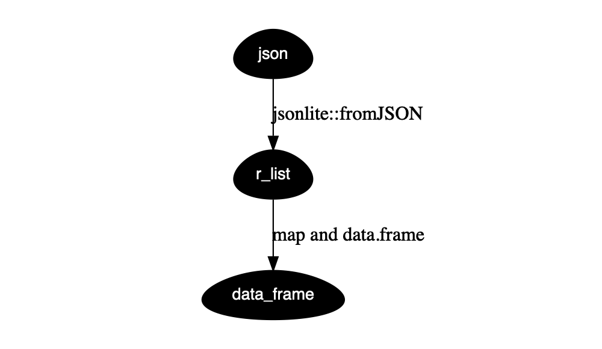

json manipulation using R
================
李家翔
2019-02-15

参考[Reference](someone/json/json.md) json 在 R 中处理方式遵循以下方式。

<!-- -->

``` r
suppressMessages(library(tidyverse))
read.csv("json.csv") %>% 
    mutate(var = as.character(var)) %>%
    # define in chr
    mutate(var = map(.x = var,.f = jsonlite::fromJSON)) %>% 
    mutate(var = map(var,as.data.frame)) %>% 
    unnest()
```

    ##   info_age             name  sex
    ## 1       28 <d5><c5><c8><fd> <NA>
    ## 2       28 <d5><c5><c8><fd>    f

参考[www.r-bloggers.com](https://www.r-bloggers.com/converting-a-list-to-a-data-frame/)
