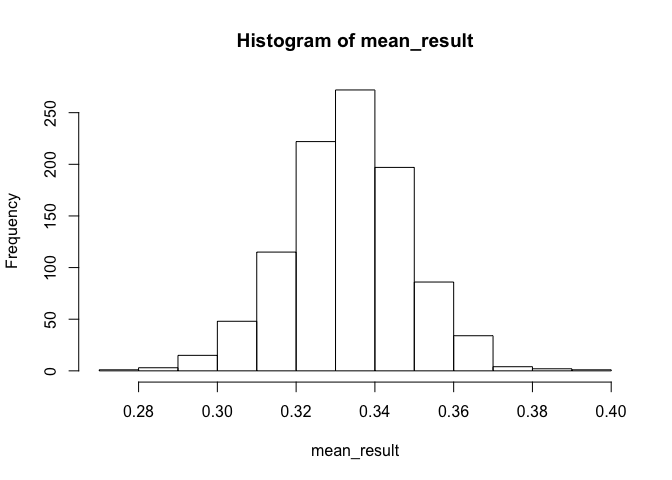

演绎法计算概率
================
Jiaxiang Li
2019-03-18

> 无穷多的猴子堆里面，保证猴子每一只重量都是独一无二，先随机取10只，称重，最重的一只重量为a，然后在剩下的猴子中再取出20只，称重，最重的重量为b，请问a\>b的概率是多少

``` r
get_output <- function(n = 100){
    items <- 1:n
    item_out <- sample(items,10)
    item_in  <- setdiff(items, item_out) %>% sample(.,20)
    max(item_out) > max(item_in)
}
```

``` r
suppressMessages(library(tidyverse))
```

todo map 无法 替代 for 循环。

## 单次实验

``` r
set.seed(123)
result <- c()
for (i in 1:100){
    element <- get_output(n = 100)
    result <- c(result,element)
}
mean(result)
```

    ## [1] 0.32

``` r
set.seed(1234)
result <- c()
for (i in 1:1000){
    element <- get_output(n = 100)
    result <- c(result,element)
}
mean(result)
```

    ## [1] 0.329

``` r
set.seed(1234)
result <- c()
for (i in 1:100){
    element <- get_output(n = 1000)
    result <- c(result,element)
}
mean(result)
```

    ## [1] 0.35

``` r
set.seed(1234)
result <- c()
for (i in 1:1000){
    element <- get_output(n = 1000)
    result <- c(result,element)
}
mean(result)
```

    ## [1] 0.355

``` r
set.seed(1234)
result <- c()
for (i in 1:1000){
    element <- get_output(n = 5000)
    result <- c(result,element)
}
mean(result)
```

    ## [1] 0.346

以上都是单次实验，以下跑多次模拟实验，看分布。

## 多次实验

时间较长，因此采用 job 方式调用。

job 查看 [multi-job.R](multi-job.R)

3分钟跑完。

``` r
mean_result <- read_rds('mean_result.rds')
```

``` r
hist(mean_result)
```

<!-- -->
