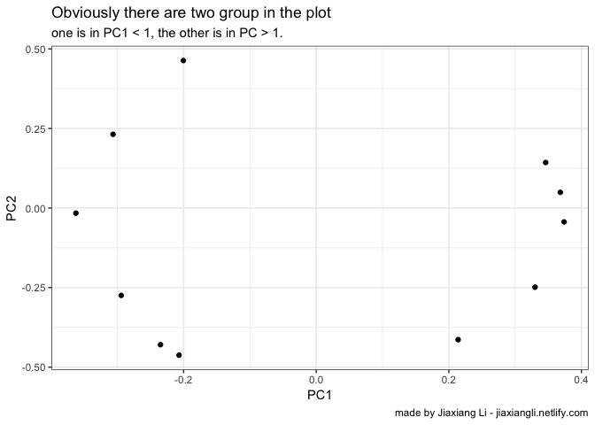
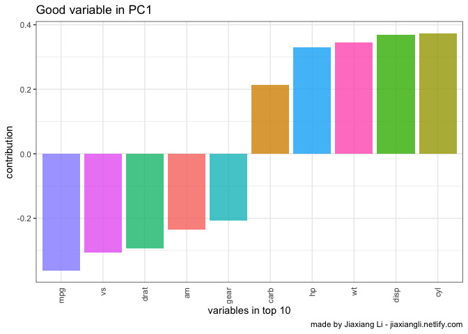
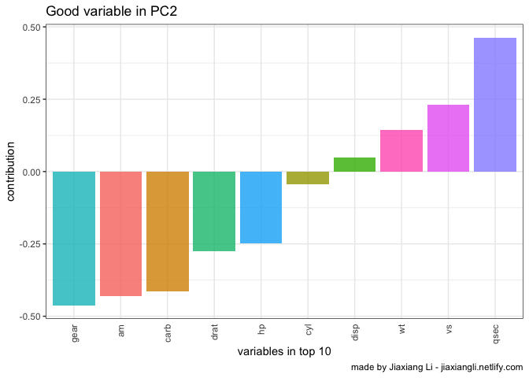

降维
================
Jiaxiang Li
2018-11-23

# PCA

以数据集`mtcars`为例

``` r
knitr::opts_chunk$set(warning = FALSE, message = FALSE)
library(data.table)
library(tidyverse)
library(irlba)
```

``` r
mtcars
```

    ## # A tibble: 32 x 11
    ##      mpg   cyl  disp    hp  drat    wt  qsec    vs    am  gear  carb
    ##  * <dbl> <dbl> <dbl> <dbl> <dbl> <dbl> <dbl> <dbl> <dbl> <dbl> <dbl>
    ##  1  21       6  160    110  3.9   2.62  16.5     0     1     4     4
    ##  2  21       6  160    110  3.9   2.88  17.0     0     1     4     4
    ##  3  22.8     4  108     93  3.85  2.32  18.6     1     1     4     1
    ##  4  21.4     6  258    110  3.08  3.22  19.4     1     0     3     1
    ##  5  18.7     8  360    175  3.15  3.44  17.0     0     0     3     2
    ##  6  18.1     6  225    105  2.76  3.46  20.2     1     0     3     1
    ##  7  14.3     8  360    245  3.21  3.57  15.8     0     0     3     4
    ##  8  24.4     4  147.    62  3.69  3.19  20       1     0     4     2
    ##  9  22.8     4  141.    95  3.92  3.15  22.9     1     0     4     2
    ## 10  19.2     6  168.   123  3.92  3.44  18.3     1     0     4     4
    ## # ... with 22 more rows

``` r
pca_data <- 
    mtcars %>% 
    na.omit() %>% 
    prcomp_irlba(n=2,center = T,scale. = T) %>% 
    .$rotation %>% 
    as.data.frame()
pca_data
```

    ## # A tibble: 11 x 2
    ##       PC1     PC2
    ##     <dbl>   <dbl>
    ##  1  0.363  0.0161
    ##  2 -0.374  0.0437
    ##  3 -0.368 -0.0493
    ##  4 -0.330  0.249 
    ##  5  0.294  0.275 
    ##  6 -0.346 -0.143 
    ##  7  0.200 -0.463 
    ##  8  0.307 -0.232 
    ##  9  0.235  0.429 
    ## 10  0.207  0.462 
    ## 11 -0.214  0.414

``` r
pca_data %>% 
    ggplot(aes(PC1,PC2)) +
    geom_point() +
    theme_bw() +
    labs(
        title = 'Obviously there are two group in the plot'
        ,subtitle = 'one is in PC1 < 1, the other is in PC > 1.'
        ,captionn = 'made by Jiaxiang Li - jiaxiangli.netlify.com'
    )
```

<!-- -->

``` r
pca_data %>% 
    mutate(name = mtcars %>% names) %>% 
    top_n(10,abs(PC1)) %>% 
    mutate(name = as.factor(name)) %>% 
    ggplot(aes(
        x = fct_reorder(name,PC1)
        ,y = PC1
        ,fill = name
    )) +
        geom_col(show.legend = FALSE, alpha = 0.8) +
        theme_bw() +
        theme(axis.text.x = element_text(angle = 90, hjust = 1, vjust = 0.5), 
              axis.ticks.x = element_blank()) +
        labs(
            x = 'variables in top 10'
            ,y = 'contribution'
            ,title = 'Good variable in PC1'
            ,captionn = 'made by Jiaxiang Li - jiaxiangli.netlify.com'
        )
```

<!-- -->

``` r
pca_data %>% 
    mutate(name = mtcars %>% names) %>% 
    top_n(10,abs(PC2)) %>% 
    mutate(name = as.factor(name)) %>% 
    ggplot(aes(
        x = fct_reorder(name,PC2)
        ,y = PC2
        ,fill = name
    )) +
        geom_col(show.legend = FALSE, alpha = 0.8) +
        theme_bw() +
        theme(axis.text.x = element_text(angle = 90, hjust = 1, vjust = 0.5), 
              axis.ticks.x = element_blank()) +
        labs(
            x = 'variables in top 10'
            ,y = 'contribution'
            ,title = 'Good variable in PC2'
            ,captionn = 'made by Jiaxiang Li - jiaxiangli.netlify.com'
        )
```

<!-- -->

# PCA regression

PCA选择两个comp最优， regression 使用这两个comp调参最优

并不代表PCA regession最优， 部分最优不等于整体最优。

# Self-Organizing Maps

这个方法主要是借鉴神经网络实现降维。 主要参考 @Schochdimensionalityreduction 这是 University of
Manchester 的一个研究员介绍的。 以下做降维测试。

使用Kaggle的
[FIFA数据集](https://www.kaggle.com/thec03u5/fifa-18-demo-player-dataset)

结果报错，回家再弄。

``` r
library(kohonen)
fifa_tbl <- fread('PlayerAttributeData.csv')
fifa_som <- fifa_tbl %>% 
    select(Acceleration:Volleys) %>%
    mutate_all(as.numeric) %>% 
    scale() %>%
    som(grid = somgrid(20, 20, "hexagonal"), rlen = 300)
```

``` r
par(mfrow=c(1,2))
plot(fifa_som, type="mapping", pch=20,
     col = c("#F8766D","#7CAE00","#00B0B5","#C77CFF")[as.integer(fifa_tbl$position2)],
     shape = "straight")
plot(fifa_som, type="codes",shape="straight")
```
